## Flutter 学习与记录

#### 1. windows 下 Flutter环境搭建
**前提**
- 操作系统: Windows 7 或更高 (64-bit)
- 磁盘空间: 400 MB (不包括Android Studio的磁盘空间).
- 工具:  Git for Windows (Git命令行工具)
- Git下载链接: [https://git-scm.com/download/win][1]
- Git安装教程: [https://blog.csdn.net/u013295518/article/details/78746007][2]

**注意**

`国内用户需要设置国内镜像`

`国内用户需要设置国内镜像`

`国内用户需要设置国内镜像`

**设置国内镜像 ==> 设置环境标量**

    用户变量 --> 当前登录用户可用的
    系统变量 --> 当前计算机所有用户可用的
 - 变量名: PUB_HOSTED_URL
 变量值: https://pub.flutter-io.cn
 - 变量名: FLUTTER_STORAGE_BASE_URL
 变量值: https://storage.flutter-io.cn

 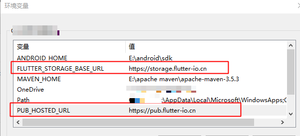

a. 在喜欢的(例如: E:\Flutter)目录下 **鼠标右击** 选择 **Git Bash Here** 在命令行中输入:

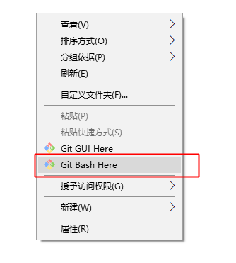

`git clone -b beta https://github.com/flutter/flutter.git`

b. 设置环境变量path中添加 flutter目录 以及android sdk及工具目录 以便可以在命令行中运行

    例如: E:\Flutter\flutter\bin

`添加成功后 需要重新打开 cmd/git 命令行才能识别 flutter命令`

d. 在命令行中执行 `flutter doctor` 查看是否需要安装任何依赖项来完成安装

    执行 `flutter doctor` 可能会出现以下几种情况:

- 1. 缺少一些工具资源, 这里等待下载安装即可如下图:

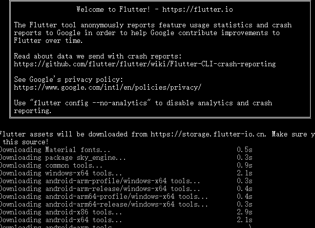

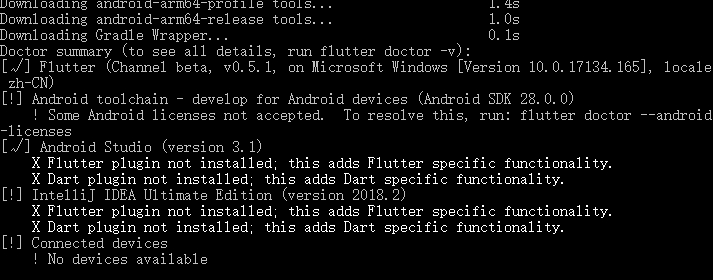

        安装完成后,会出现如上图所示, 可用(√),警告(!),不可用(×)的三种情况的 4条或5条类目
		其中: 1.Flutter版本环境信息; 2.Android SDK信息;
		3,4为本地支持的开发工具(如有警告 说明工具没有集成Flutter,Dart插件);5.可连接调试的设备

- 2. **如果你不想看到 Android SDK 的警告**, 执行 `flutter doctor --android-licenses` 接受协议即可

如下图,我这里6个协议有5个协议没有接受 如下图, 选择Y/N 接受协议 一直接受即可

e. **Android Studio 或者 IDEA 没有安装集成 Flutter 和 Dart 插件** 这里以Android Studio为例

Android Studio 中 Ctrl + alt + S 打开 `设置` 找到 `Plugins` 选项卡 选择 `Browse repositories..` 然后 在搜索框中 输入 `Flutter` 在右方点击安装, 会提示是否和Dart插件一起安装 确认即可  **安装完成后重启** 即可看到 `Start a new Flutter Project` 选项 流程如下图:

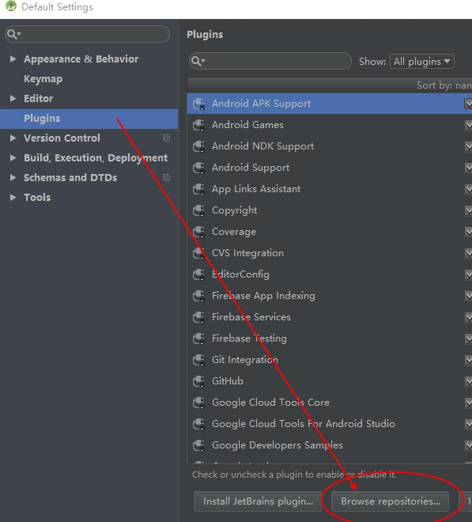

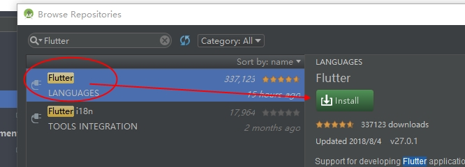

	此时我们在命令行再次执行 `flutter doctor` 会发现 原来的Android Studio 下的两个不可用 已经没有了, 如下图

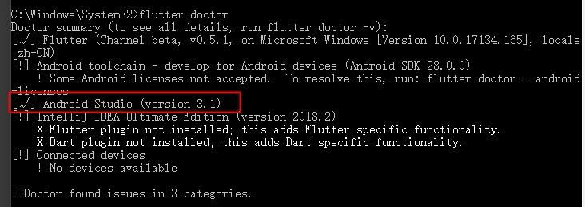

f. **Android Studio 创建 第一个 Flutter 项目**

选择 `Start a new Flutter Project` 在 对话框中 选择 `Flutter Application` 然后 next , 然后在新对话框中输入项目名称,指定 Flutter的 安装目录,指定项目保存的地址,项目描述 ,然后 next , 再新窗口中填入包名信息 **如遇到无法成功创建, 关闭Android Studio, 删除项目目录的.idea文件夹, 重启并打开此项目即可** 流程如下图:

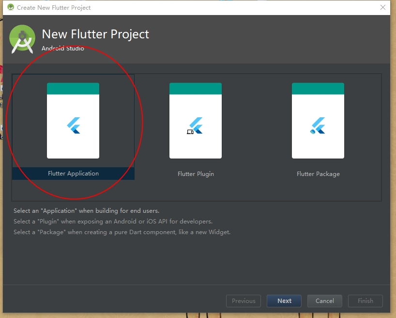

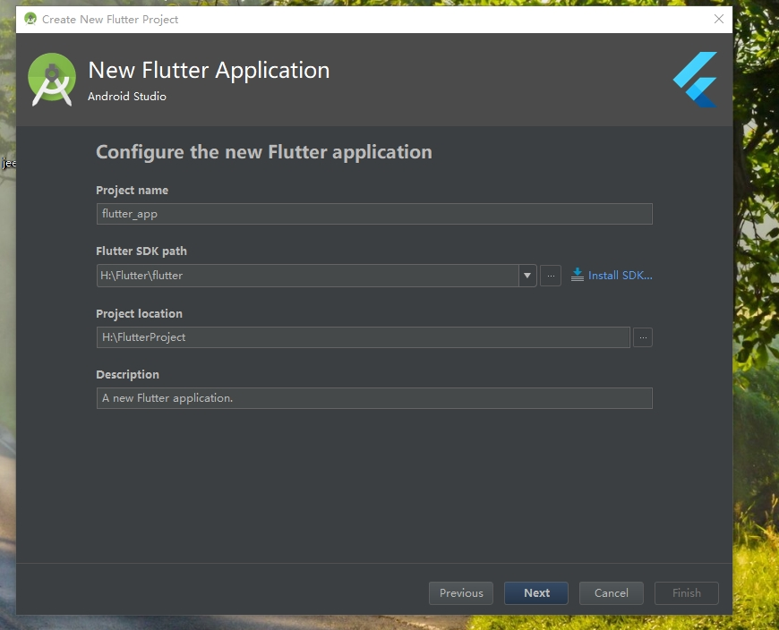

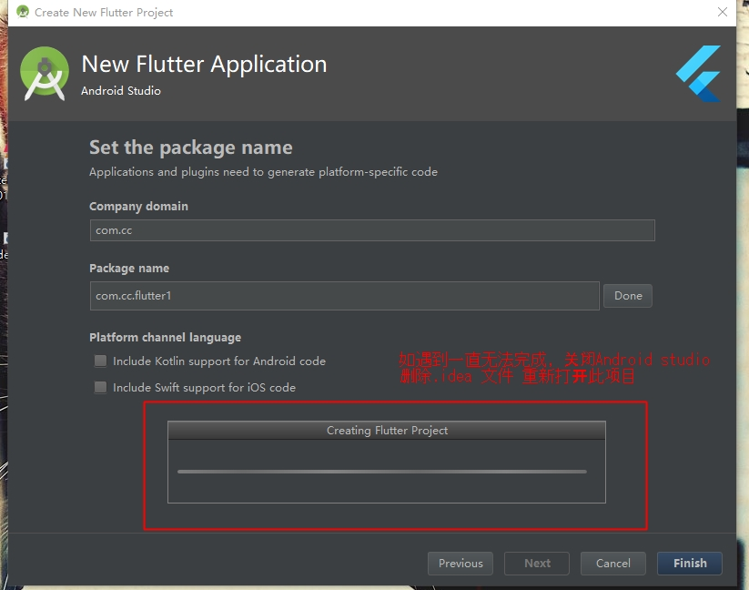

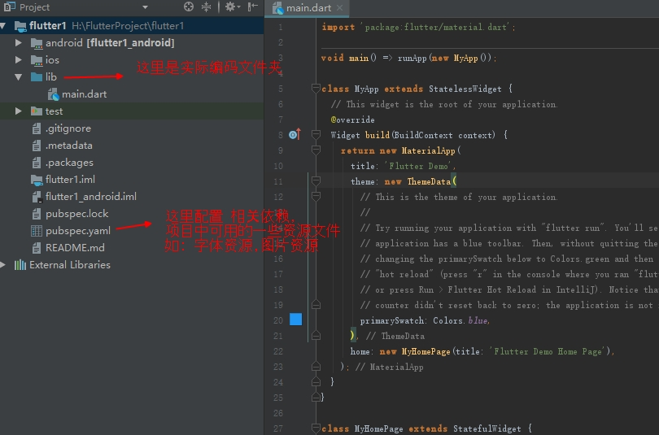

[0]: https://flutterchina.club/get-started/install/
[1]: https://git-scm.com/download/win
[2]: https://blog.csdn.net/u013295518/article/details/78746007